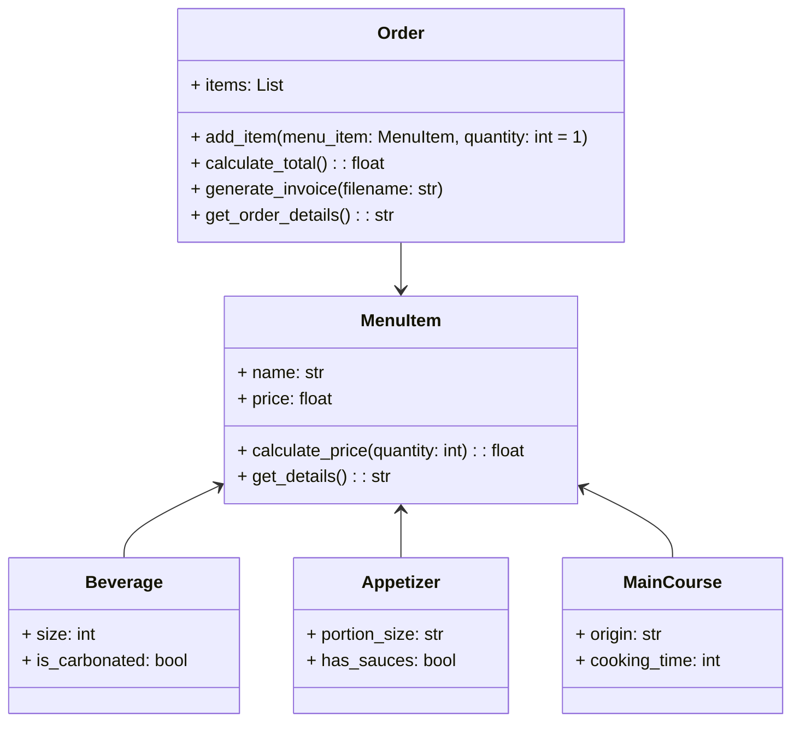

# reto_3
## Ejercicio de clase
Se añadió la clase Line al código que se había estado trabajando en las clases anteriores.

```python
import math

class Point:
    definition: str = "Entidad geométrica abstracta que representa una ubicación en un espacio."
    def __init__(self, x: float = 0, y: float = 0):
        self.x = x
        self.y = y

    def move(self, new_x: float, new_y: float):
        self.x = new_x
        self.y = new_y

    def reset(self):
        self.x = 0
        self.y = 0

    def compute_distance(self, point: "Point") -> float:
        distance = ((self.x - point.x) ** 2 + (self.y - point.y) ** 2) ** 0.5
        return distance

class Line:
    def __init__(self, start: Point, end: Point):
        self.start = start
        self.end = end

    def compute_length(self):
        return self.start.compute_distance(self.end)

    def compute_slope(self):
        if self.end.x == self.start.x:
            return 90.0
        slope_radians = math.atan2(self.end.y - self.start.y, self.end.x - self.start.x)
        return math.degrees(slope_radians)

    def compute_horizontal_cross(self):
        return self.start.y * self.end.y <= 0

    def compute_vertical_cross(self):
        return self.start.x * self.end.x <= 0

class Rectangle:
    def __init__(self, **kwargs):
        if "center" in kwargs:
            center = kwargs["center"]
            width = kwargs["width"]
            height = kwargs["height"]
            x = center.x - width / 2
            y = center.y - height / 2
        elif "bottom_left" in kwargs and "upper_right" in kwargs:
            bottom_left = kwargs["bottom_left"]
            upper_right = kwargs["upper_right"]
            x = bottom_left.x
            y = bottom_left.y
            width = upper_right.x - bottom_left.x
            height = upper_right.y - bottom_left.y
        else:
            x = kwargs["x"]
            y = kwargs["y"]
            width = kwargs["width"]
            height = kwargs["height"]

        self.bottom_left = Point(x, y)
        self.upper_right = Point(x + width, y + height)
        self.width = width
        self.height = height

    def compute_perimeter(self):
        return 2 * (self.width + self.height)

    def compute_area(self):
        return self.width * self.height

class Square(Rectangle):
    def __init__(self, side_length: float, **kwargs):
        kwargs["width"] = side_length
        kwargs["height"] = side_length
        super().__init__(**kwargs)


rect1 = Rectangle(x=0, y=0, width=10, height=5)
print(rect1.compute_perimeter())

center = Point(5, 5)
rect2 = Rectangle(center=center, width=10, height=8)
print(rect2.compute_perimeter())

bottom_left = Point(2, 3)
upper_right = Point(10, 8)
rect3 = Rectangle(bottom_left=bottom_left, upper_right=upper_right)
print(rect3.compute_area())
```

## Restaurant
Restaurant scenario: You want to design a program to calculate the bill for a customer's order in a restaurant.
- Define a base class MenuItem: This class should have attributes like name, price, and a method to calculate the total price.
- Create subclasses for different types of menu items: Inherit from MenuItem and define properties specific to each type (e.g., Beverage, Appetizer, MainCourse).
- Define an Order class: This class should have a list of MenuItem objects and methods to add items, calculate the total bill amount, and potentially apply specific discounts based on the order composition.
### Diagrama de clases
Para hacer el ejercicio se diseñó el siguiente diagrama de clases.


### Codigo
El código que se usó para resolver la situación planteada fue el siguiente.

```python
class MenuItem:
    def __init__(self, name, price):
        self.name = name
        self.price = price

    def calculate_price(self, quantity=1):
        return self.price * quantity

    def get_details(self):
        return f"{self.name}: COP {self.price}"


class Beverage(MenuItem):
    def __init__(self, name, price, size, is_carbonated):
        super().__init__(name, price)
        self.size = size  # Size in milliliters
        self.is_carbonated = "Sí" if is_carbonated else "No"

    def get_details(self):
        return (
            f"{super().get_details()}, Tamaño: {self.size}ml, "
            f"Carbonatada: {self.is_carbonated}"
        )


class Appetizer(MenuItem):
    def __init__(self, name, price, portion_size, has_sauces):
        super().__init__(name, price)
        self.portion_size = portion_size
        self.has_sauces = "Sí" if has_sauces else "No"

    def get_details(self):
        return (
            f"{super().get_details()}, Porción: {self.portion_size}, "
            f"Con salsas: {self.has_sauces}"
        )


class MainCourse(MenuItem):
    def __init__(self, name, price, origin, cooking_time):
        super().__init__(name, price)
        self.origin = origin
        self.cooking_time = cooking_time  

    def get_details(self):
        return (
            f"{super().get_details()}, Origen: {self.origin}, "
            f"Tiempo de preparación: {self.cooking_time} min"
        )


class Order:
    def __init__(self):
        self.items = []

    def add_item(self, menu_item, quantity=1):
        self.items.append((menu_item, quantity))

    def calculate_total(self):
        return sum(item.calculate_price(quantity) for item, quantity in self.items)

    def generate_invoice(self, filename):
        file = open(filename, "w")
        file.write("Factura\n")
        file.write("==========\n")
        for item, quantity in self.items:
            file.write(
                f"{item.get_details()} x{quantity}: "
                f"COP {item.calculate_price(quantity)}\n"
            )
        file.write("==========\n")
        total = self.calculate_total()
        file.write(f"Total: COP {total}\n")
        file.write("==========\n")
        file.write("Gracias por su compra!\n")
        file.close()

    def get_order_details(self):
        receipt = "Detalles de la Orden:\n"
        for item, quantity in self.items:
            receipt += (
                f"{item.get_details()} x{quantity}: "
                f"COP {item.calculate_price(quantity)}\n"
            )
        receipt += f"Total: COP {self.calculate_total()}"
        return receipt


menu_items = [
    Beverage("Gaseosa", 2500.00, 500, True),
    Beverage("Café", 2000.00, 250, False),
    Beverage("Té Helado", 3000.00, 300, False),
    Appetizer("Papas Fritas", 4000.00, "Mediana", True),
    Appetizer("Nachos", 6000.00, "Grande", True),
    Appetizer("Alitas de Pollo", 8000.00, "Grande", True),
    MainCourse("Pasta Carbonara", 12000.00, "Italia", 15),
    MainCourse("Tacos al Pastor", 10000.00, "México", 10),
    MainCourse("Pollo Asado", 15000.00, "Colombia", 20),
    MainCourse("Sushi", 20000.00, "Japón", 25),
]

order = Order()
order.add_item(menu_items[0], 2)  
order.add_item(menu_items[3], 1)  
order.add_item(menu_items[6], 1)  
order.add_item(menu_items[7], 2)  

print(order.get_order_details())

order.generate_invoice("factura.txt")
print("Factura generada en el archivo 'factura.txt'.")
```
