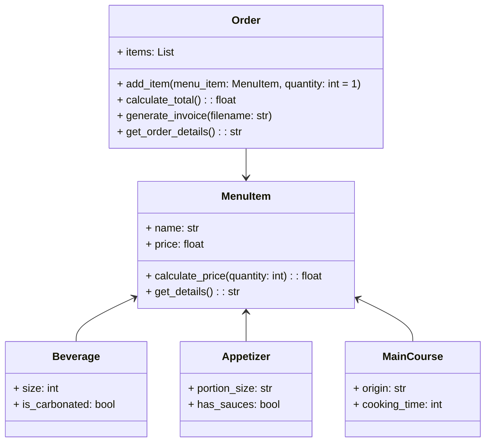

# reto_3
## Ejercicio de clase
Se añadio la clase Line al codigo que se habia estado trabajando en las anteriores clases.

```python
import math

class Point:
    definition: str = "Entidad geométrica abstracta que representa una ubicación en un espacio."
    def __init__(self, x: float = 0, y: float = 0):
        self.x = x
        self.y = y

    def move(self, new_x: float, new_y: float):
        self.x = new_x
        self.y = new_y

    def reset(self):
        self.x = 0
        self.y = 0

    def compute_distance(self, point: "Point") -> float:
        distance = ((self.x - point.x) ** 2 + (self.y - point.y) ** 2) ** 0.5
        return distance

class Line:
    def __init__(self, start: Point, end: Point):
        self.start = start
        self.end = end

    def compute_length(self):
        return self.start.compute_distance(self.end)

    def compute_slope(self):
        if self.end.x == self.start.x:
            return 90.0
        slope_radians = math.atan2(self.end.y - self.start.y, self.end.x - self.start.x)
        return math.degrees(slope_radians)

    def compute_horizontal_cross(self):
        return self.start.y * self.end.y <= 0

    def compute_vertical_cross(self):
        return self.start.x * self.end.x <= 0

class Rectangle:
    def __init__(self, **kwargs):
        if "center" in kwargs:
            center = kwargs["center"]
            width = kwargs["width"]
            height = kwargs["height"]
            x = center.x - width / 2
            y = center.y - height / 2
        elif "bottom_left" in kwargs and "upper_right" in kwargs:
            bottom_left = kwargs["bottom_left"]
            upper_right = kwargs["upper_right"]
            x = bottom_left.x
            y = bottom_left.y
            width = upper_right.x - bottom_left.x
            height = upper_right.y - bottom_left.y
        else:
            x = kwargs["x"]
            y = kwargs["y"]
            width = kwargs["width"]
            height = kwargs["height"]

        self.bottom_left = Point(x, y)
        self.upper_right = Point(x + width, y + height)
        self.width = width
        self.height = height

    def compute_perimeter(self):
        return 2 * (self.width + self.height)

    def compute_area(self):
        return self.width * self.height

class Square(Rectangle):
    def __init__(self, side_length: float, **kwargs):
        kwargs["width"] = side_length
        kwargs["height"] = side_length
        super().__init__(**kwargs)


rect1 = Rectangle(x=0, y=0, width=10, height=5)
print(rect1.compute_perimeter())

center = Point(5, 5)
rect2 = Rectangle(center=center, width=10, height=8)
print(rect2.compute_perimeter())

bottom_left = Point(2, 3)
upper_right = Point(10, 8)
rect3 = Rectangle(bottom_left=bottom_left, upper_right=upper_right)
print(rect3.compute_area())
```

## Restaurant
Restaurant scenario: You want to design a program to calculate the bill for a customer's order in a restaurant.
- Define a base class MenuItem: This class should have attributes like name, price, and a method to calculate the total price.
- Create subclasses for different types of menu items: Inherit from MenuItem and define properties specific to each type (e.g., Beverage, Appetizer, MainCourse).
- Define an Order class: This class should have a list of MenuItem objects and methods to add items, calculate the total bill amount, and potentially apply specific discounts based on the order composition.
### Solucion
Para hacer el siguiente ejercicio se diseño el siguiente diagrama de clases.

